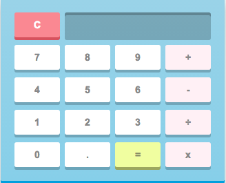
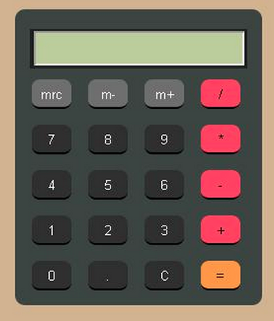
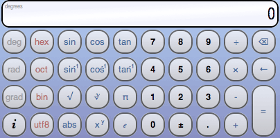

# CALCULATOR LAB

Your challenge is quite simple… build a calculator using HTML, CSS AND JavaScript. This is an opportunity to get more comfortable with JavaScript ***AND*** HTML/CSS. If you feel more comfortable with JS, then use this opportunity to improve your HTML/CSS (and vice versa).

Here are some visual examples:

------

### Basic Challenge Requirements

- Have a fully functional calculator that can ***ADD***, ***SUBTRACT***, ***DIVIDE***, and ***MULTIPLY***
- Implement a “Clear” button/function that clears the current
- An operator should not be allowed to be the first character in your equation
- Don’t allow the user to enter two operators (e.g. +,=,*,/) back to back

### Challenge Add-ons

- Don’t use the eval() function in your code
- Create buttons/functions that implement features found in scientific calculators (e.g., ***log***, ***sin***, ***sqrt***, ***exponentials***, etc.

------