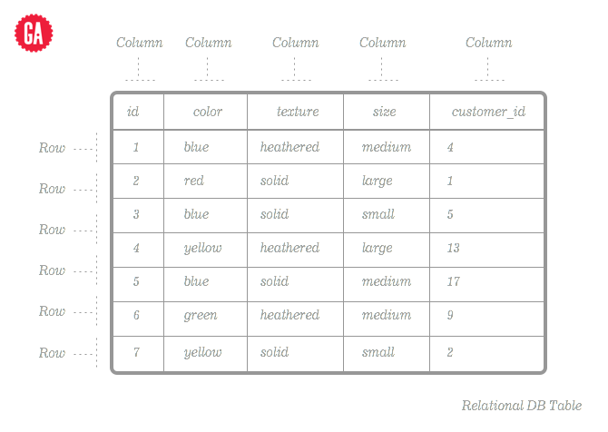

# Intro to Relational Data Modeling

### Objectives
- Describe the relationship between tables, rows, and columns
- Draw entity relationship diagrams (ERDs) with crow's foot notation for ideas for web apps
- Describe how tables relate to each other using foreign keys
- Explain the different relationship types:
  - one to one
  - one to many
  - many to many

### Preparation

- Describe how objects have attributes and functionality associated with them

## What are Databases?

A database is a place where information gets stored in a hard drive - or distributed across multiple hard drives - on a computer somewhere. Much like we've been creating and storing data, here and there, a database represents a collection of individual pieces of data stored in a highly structured and searchable way; they represent a model of reality, which is why we call them models in MVC.

Inside a database, we do basic actions like create, read, update, and destroy data (CRUD).

In modern web development, there are different categories of databases – SQL, NoSQL, Key/Value. We're focusing on SQL because historically that's the father to the others, but we will use a NoSQL database later in the course.

SQL stands for Structured Query Language, and it's a language used to manage and get information from what are considered "relational" databases (Jimmy will talk more about SQL in the next lesson).

We call these "relational" because different models - or pieces of data - can be linked to other models, aka "related". Relational DBs store data in a "table" so think of it like a spreadsheet. The table holds all the data for one model, while the columns define what attributes that model has; we often call columns "attributes" or "fields". A row is an instance (remember instantiation!), like a unique copy of the blueprint that is our model, often called a record.

## Let's Draw on The Board

Let's say we're making an app for a library and look at what some tables would look like (e.g. what information or attributes would be associated with each table?)

- What would the table for a book look like?
- What would the table for an author look like?
- What would the table for a category look like?

See, this is when we start seeing relationships form. This is great. You can imagine duplicate pieces of data being stored naturally, especially when an author has multiple books, for instance. That's a waste of space!  So, let's talk about how we can connect these tables, this way, we don't have tons of duplicate data all over the place.

## Relationships - Whiteboard Demo

Relationships happen when we start seeing duplicate information or when one object needs to "connect" to another object.

---

## The 3 most common relationships:

### One to One
- not frequently used, but important to know it's an option
- imagine a Library table `has_one` location, and a location `belongs_to` a specific library - that lets us look up solely by location, and see the connected library
- often, in situations like that, you can make the location an attribute of the library, but when a location has, for example, multiple fields (address 1, address 2, city, state, zip, etc.), it might make sense to create another table for addresses and set up a `has_one` relationship

### One to Many
- the most common type of database relationship
- an author `has_many` books, but a book `belongs_to` only one author

### Many to Many
- also very frequent
- a book probably "has many" categories, and a category also probably "has many" books

Keep in mind, the `belongs_to` part always goes on the opposite side of the `has_many` or `has_one`. And the way it's stored is that the ID of the model that "has" something is stored in a field on the child, like "customer_id" or "author_id".  In our example with authors and books, the Book model `belongs_to` the Author model, while the Author, as mentioned, `has_many` books.

## Independent Practice

 Working with a partner, draw out some Entity Relation Diagrams like we have on the board, with crow's foot notation like we have.

 Try drawing one (or more, if you're fast) of the following:

- A social media site, with users and posts/tweets/pins
- An online ordering system, with customers and orders
- A bar drink system, with orders, customers, drinks, and/or liquors

## Conclusion
- How do you represent a relational database in drawings?
- How would you describe the metaphor of storing data like a spreadsheet?
- What are the three types of relationships, and what are some examples of how you would you use them?
